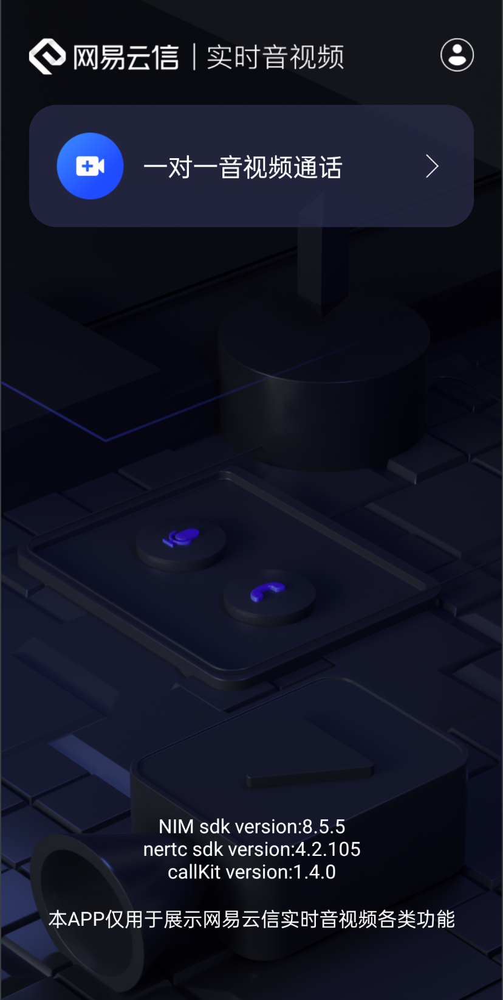
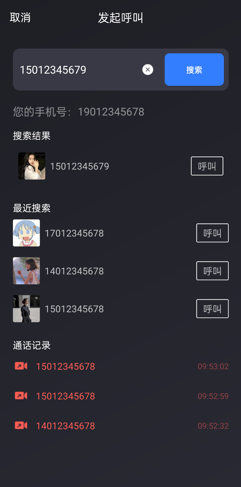
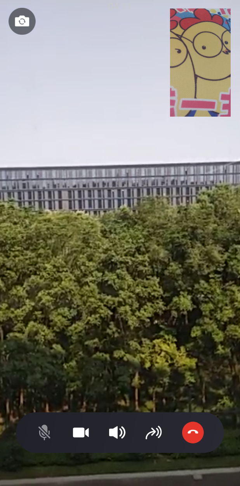

# 概述

## 产品介绍

为了方便开发者接入音视频2.0 呼叫功能，我们将信令和NERtc的音视频能力结合简化呼叫的复杂流程，以组件的形式提供给客户，提高接入效率，降低使用成本。组件内部提供音视频类型通话的呼叫、接通、拒接，以及通话中音频、视频的开关控制，同时提供配套 UI 方便用户直接使用，用户可以使用呼叫组件实现类似通用即时通讯应用中的音视频通话功能。

## 功能特性

| 功能        | 描述                                                         |
| :---------- | ------------------------------------------------------------ |
| 自定义UI    | 用户可以按设计自己的通话/呼叫页面ui                          |
| 音/视频呼叫 | 用户可以通过此功能通知被叫用户呼叫请求，分类有音频和视频呼叫两种 |
| 音/视频通话 | 用户接通后可依照呼叫类型进行实时通话                         |
| 音/视频控制 | 通话过程中可以控制本端音频/视频的开关，以及摄像头前置/后置等 |
| 话单        | 用户每次的通话结束后都会收到对应的话单消息，标记本次通话是否接通以及通话时间、类型等 |

## 产品架构

呼叫组件是基于云信信令、音视频2.0、IM 通信能力封装的融合性场景sdk ，用户可以直接使用呼叫组件完成呼叫业务。

## 体验应用
### 下载 Demo
|                        Android 安装包                        | [iOS安装包](https://apps.apple.com/cn/app/云信视频通话/id1531079950) | [Web 体验](https://yiyong.netease.im/yiyong-xkit/iframe.html?id=call-kit-%E5%91%BC%E5%8F%AB%E7%BB%84%E4%BB%B6--single&args=&viewMode=story) |                          小程序体验                          |
| :----------------------------------------------------------: | :----------------------------------------------------------: | :----------------------------------------------------------: | :----------------------------------------------------------: |
|  |  |  |  |

### 效果展示

首页：

搜索页面：

视频呼叫页面：

视频通话页面：

音频呼叫页面：

音频通话页面：

视频/音频被叫页面：

