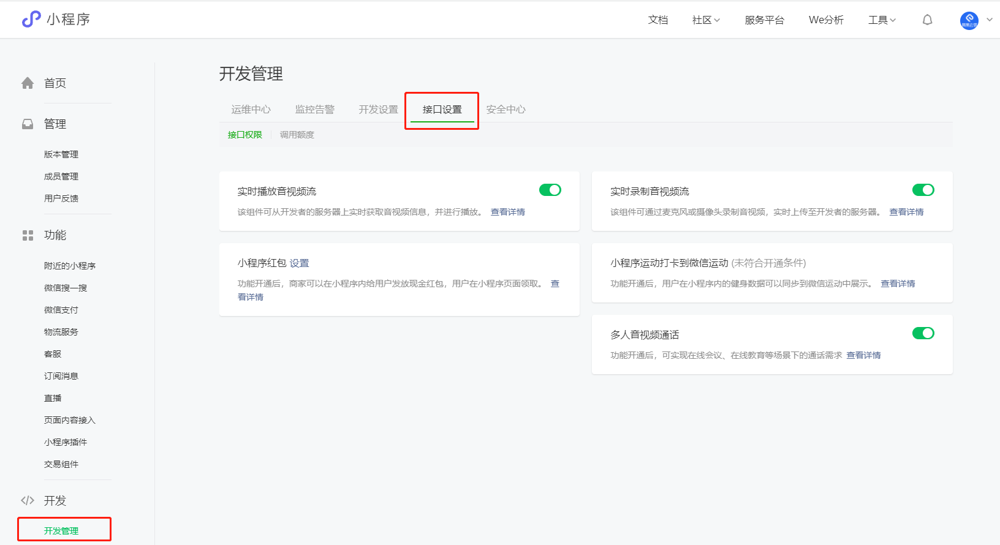

# 实现通话呼叫

针对已经集成 IM sdk 的用户若希望快速实现音视频通话功能，可通过集成呼叫组件完成实现。

## 注意事项
1. 若用户已经集成了 IM Sdk 或 NERTc Sdk 需参考**[产品动态](./产品动态-小程序.md) **关于 sdk 版本的映射关系，确保使用的 sdk 版本和组件版本一致。
2. 若用户未接入 IM Sdk 可参考[官网](https://doc.yunxin.163.com/docs/TM5MzM5Njk/zU4NzUxNjI?platformId=60002)完成 IM Sdk 的接入。

**用户完成上述两点注意后继续参考下面内容。**

## 准备工作

在开始运行示例项目之前，请确保您已完成以下操作：
联系云信商务获取开通以下权限，并联系技术支持配置产品服务和功能

#### 1. 环境准备
  * 微信 App iOS 最低版本要求：7.0.9。
  * 微信 App Android 最低版本要求：7.0.8。
  * 小程序基础库最低版本要求：2.10.0。
  * 已安装最新版本的微信开发者工具。
  * 已安装微信的移动端设备以供调试和运行体验。
  * 由于微信开发者工具不支持原生组件（即 `<live-pusher>` 和 `<live-player>` 标签），需要在真机上进行运行体验。
  * 由于小程序测试号不具备 `<live-pusher>` 和 `<live-player>` 的使用权限，需要申请常规小程序账号进行开发。
  * 不支持 uniapp 开发环境，请使用原生小程序开发环境。

#### 2. 权限申请

   在开始集成之前，请确保您已完成以下操作：
   联系云信商务获取开通以下权限，并联系技术支持配置产品服务和功能

   1. 通过文档[应用创建和服务开通](../../应用创建和服务开通.md)完成相关权限开通；
   2. 获取对应 AppKey；

#### 3. 前提条件

1. 您已网易[云信账号](https://yunxin.163.com/)，并完成实名认证。

2. 出于政策和合规的考虑，微信暂未放开所有小程序对实时音视频功能（即`<live-pusher>` 和 `<live-player>`标签）的支持：
* 小程序推拉流标签不支持个人小程序，只支持企业类小程序。
* 小程序推拉流标签使用权限暂时只开放给有限 类目。
* 符合类目要求的小程序，需要在[【微信公众平台】](https://mp.weixin.qq.com/)>【开发】>【开发管理】>【接口设置】中自助开通该组件权限，如下图所示：



## 集成

若需要在项目中引入呼叫组件按照以下步骤执行：

### 1. 前提 

已经完成云信 IM Sdk 接入，并实现了登录功能；

### 2. 复制 nertc-call 到 components 文件

### 3. 添加组件到对应page
```js
// xxx.json
{
  "usingComponents": {
    "nertc-call": "../../components/nertc-call/nertc-call"
  }
}
```

### 4. 使用组件

**wxml文件**

```
  <nertc-call id="nertc-component" config="{{rtcConfig}}" />
```

**js文件**

```js
  Page({
    /**
     * 页面的初始数据
     */
    data: {
      rtcConfig: {
        appkey: '45c6af3c98409b18a84451215d0bdd6e',
        uid: 1,
        imToken: 'e10adc3949ba59abbe56e057f20f883e', //im 登录token
        account: 'luc007',
        nickName: 'luc007',
        passport: '123456',
        openCamera: true,
        openMicrophone: true,
        resolution: 'HD',
        audioQuality: 'high',
        videoWidth: 360,
        videoHeight: 640,
        minBitrate: 600,
        maxBitrate: 900,
        whitenessLevel: 4,
        beautyLevel: 4,
        checkSum: true, //默认安全模式
        debug: false,
      },
      userId: '',
      type: 2, // 1：语音通话，2：视频通话
    },
  
  
    /**
     * 生命周期函数--监听页面加载
     */
    onLoad: function (options) {
      this.nertcComponent = this.selectComponent('#nertc-component')
      this.bindEvent()
    },
    /**
     * 生命周期函数--监听页面卸载
     */
    onUnload: function () {
      // 取消监听事件
      this.unbindTRTCCallingRoomEvent();
      // 退出登录
      this.TRTCCalling.logout();
    },

    startCall() {
      this.nertcComponent.call({
        userId: this.data.userId,
        type: this.data.type,
        attachment: { call: "testValue" },
        success: (res) => {
          console.log("==call 成功回调", res)
        },
        fail: (err) => {
          console.log("==call 失败回调", err)
        }
      })
    },

    onAccept() {
      this.nertcComponent.accept({
        ...this.data.inviteData,
        success: (data) => {
          console.log("接受呼叫:成功回调", data)
        },
        fail: (err) => {
          console.log("接受呼叫:失败回调", err)
        }
      })
    },

    onReject() {
      this.nertcComponent.reject({
        ...this.data.inviteData, success: (data) => {
          console.log("拒绝呼叫:成功回调", data)
        },
        fail: (err) => {
          console.log("拒绝呼叫:失败回调", err)
        }
      })
    },

    bindEvent() {
      const nertcComponentEvent = this.nertcComponent.EVENT
      console.log("this.nertcComponent", this.nertcComponent)
      //收到邀请
      this.nertcComponent.on(nertcComponentEvent.INVITED, (data) => {
        console.log("be invite", data)
      })
      //自主设置呼叫|被呼的超时时间
      this.nertcComponent.setCallTimeout(30000)
      //被呼叫用户接受  
      this.nertcComponent.on(nertcComponentEvent.USER_ACCEPT, (data) => {
        console.log("user accept", data)
      })
      //被呼叫用户拒绝
      this.nertcComponent.on(nertcComponentEvent.USER_REJECT, (data) => {
        console.log("user reject", data)
      })
      //被呼叫用户超时
      this.nertcComponent.on(nertcComponentEvent.USER_BUSY, () => {
        console.log("user busy")
      })
      //呼叫超时
      this.nertcComponent.on(nertcComponentEvent.CALLING_TIMEOUT, () => {
        console.log("call timeout")
      })
      //取消呼叫
      this.nertcComponent.on(nertcComponentEvent.USER_CANCEL, (data) => {
        console.log("user cancel===", data)
      })
      //通话结束
      this.nertcComponent.on(nertcComponentEvent.CALL_END, () => {
        console.log("====onCallEnd======")
      })
      //disconnect
      this.nertcComponent.on("onDisconnect", () => {
        console.log("====onDisconnect======")
      })
      this.nertcComponent.on(nertcComponentEvent.OTHER_CLIENT_REJECT, () => {
        //your code
      })
      this.nertcComponent.on(nertcComponentEvent.OTHER_CLIENT_ACCEPT, () => {
        //your code
      })
      this.nertcComponent.on(nertcComponentEvent.MESSAGE_SENT, (data) => {
        console.log("===on message send ,", data)
        const { status, to } = data.data
        const isBeCaller = to === this.data.rtcConfig.account
        const statusMap = {
          1: "已完成",
          2: isBeCaller ? "对方已取消" : "已取消",
          3: isBeCaller ? "已拒绝" : '对方已拒绝',
          4: isBeCaller ? "未接听" : '未接听',//对方超时未接听
          5: isBeCaller ? "未接听" : "对方忙线",
        };
        this.setData({
          statusText: statusMap[status]
        })
      })
      this.nertcComponent.on(nertcComponentEvent.AUDIO_AVAILABLE, () => {
        //your code
      })
      this.nertcComponent.on(nertcComponentEvent.VIDEO_AVAILABLE, () => {
        //your code
      })
      this.nertcComponent.on(nertcComponentEvent.CALL_TYPE_CHANGE, () => {
        //your code
      })
    }
  })
  
```
### nertc 属性

| 参数 | 类型 | 必填 | 说明 |
|:---:| - | - | - |
| id  | String | 是 | 绑定nertc-call的dom ID，可通过this.selectComponent(ID)获取实例 |
| config | Object | 是 | nertc-call初始化配置 |

### config 参数

| 参数 | 类型 | 必填 | 默认 | 说明 |
|:---:| - | - | - | - |
| appKey | String | 是 | - | 创建网易云信应用的唯一key |
| uid | String | 是 | - | 用户随机数 |
| imToken | String | 是 | - | 呼叫方登录密码加密数据 |
| account | String | 是 | - |  呼叫方账号 |
| nickName | String | 否 | - | 呼叫方昵称 |
| openCamera | Boolean | 否 | true | 是否开启摄像头 |
| openMicrophone | Boolean | 否 | true | 是否开启麦克风 |
| videoWidth | Number | 否 | 360 | 视频画面的宽度 |
| videoHeight | Number | 否 | 640 | 视频画面的高度 |
| minBitrate | Number | 否 | 600 | 最小码率 |
| maxBitrate | Number | 否 | 900 | 最大码率 |
| whitenessLevel | Number | 否 | 0 | 美白等级 |
| beautyLevel | Number | 否 | 0 | 美颜等级 |
| checkSum | Boolean | 否 | true | 是否开启安全模式 |
| debug | Boolean | 否 | false | 是否开启调试模式 |

## 组件方法

**selectComponent()**

您可以通过小程序提供的 this.selectComponent() 方法获取组件实例

```
this.nertcComponent = this.selectComponent('#nertc-component')
```

> **若已经在项目里实现了 NIMSDK 登录逻辑，则需要<font color="red">替换相应的登录接口，参数保持一致。</font>**
否则，可使用组件的login()进行登录，同样可使用logout()进行登出，***登出或未进行登录则不能进行呼叫***。

**login({ account, token, ...opt})** 

登入接口，会建议在页面 onLoad 阶段调用。

```
this.selectComponent('#nertc-component').login()
```

**logout()**

登出信令 SDK，执行后不再能收发信令。

```
this.selectComponent('#nertc-component').logout()
```

**on(eventCode, handler, context)**

用于监听组件派发的事件，详细事件请参见 事件表。

```
this.selectComponent('#nertc-component').on(nertcComponentEvent.INVITED, () => {

})
```

**off(eventCode, handler)**

用于取消事件监听。

```
this.selectComponent('#nertc-component').off(nertcComponentEvent.INVITED)
```

**call({userID, type})**

进行某个 user 进行呼叫

|参数|含义|
|--|--|
|userId| 希望呼叫用户的 userId。|
|type| 通话类型，type = 1：语音通话，type =2：视频通话。|

```
this.selectComponent('#nertc-component').call({userId, type})
```
