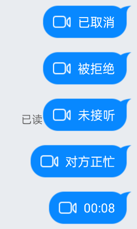

## 话单说明



如上图，话单为进行通话呼叫时发送的一条消息，标记此次呼叫的状态；上图分别对应**主叫取消话单**、**被叫拒绝话单**、**超时未接听话单**、**被叫占线话单**、**正常通话带有时长的话单**。

## 话单发送

若用户参考[快速开始](../../../快速开始-Android.md)完成话单功能相关权限开通，则会默认发送话单消息；

话单消息共有5类，其中4类为未接通时的话单，如拒接话单、占线话单、超时未接听话单、主叫取消话单，此类话单均由主叫方客户端发送；1类为带有通话时长的正常话单，此类话单为服务端直接发送。话单结构见话单解析部分。

**！！！！呼叫组件不包含话单接收及解析功能，用户可参考代码自行实现。详细可看 [消息收发](http://dev.yunxin.163.com/docs/product/IM即时通讯/SDK开发集成/Android开发集成/消息收发?#消息接收)！！！！**

## 话单接收及解析

话单消息同普通消息一样通过 IM sdk 进行消息接收，**示例代码** 如下：

```java
/**
  * 话单消息接收注册，同正常消息接收一样
  */
private void registerObserver() {
	/**
	  * 注册消息接收观察者。 <br>
	  * 通知的消息列表中的消息不一定全是接收的消息，也有可能是自己发出去，比如其他端发的消息漫游过来，
	  */
	NIMClient.getService(MsgServiceObserve.class).observeReceiveMessage(new Observer<List<IMMessage>>() {
		@Override
		public void onEvent(List<IMMessage> imMessages) {
			for (IMMessage item : imMessages) {
				parseForNetCall(item);
			}
		}
	}, true);
	/**
	  * 用于发送消息后本地列表解析对应消息
	  */
	NIMClient.getService(MsgServiceObserve.class).observeMsgStatus(new Observer<IMMessage>() {
		@Override
		public void onEvent(IMMessage imMessage) {
			parseForNetCall(imMessage);
		}
	}, true);
}

```


### 话单类型及结构体

| 代码                                    | 话单类型 | 说明                                                         |
| --------------------------------------- | -------- | ------------------------------------------------------------ |
| `NrtcCallStatus.NrtcCallStatusComplete` | 1        | 正常通话话单，通话双方都进入音视频通话后进行挂断。由组件服务器发送。 |
| `NrtcCallStatus.NrtcCallStatusCanceled` | 2        | 主叫取消话单，主叫呼叫后主动取消的话单。由客户端主叫方发送。 |
| `NrtcCallStatus.NrtcCallStatusRejected` | 3        | 被叫拒接话单，被叫拒接接听后的话单。客户端主叫方收到被叫拒接消息后进行发送。 |
| `NrtcCallStatus.NrtcCallStatusTimeout`  | 4        | 超时话单，被叫收到通话邀请后不操作等待超时产生的话单。客户端主叫方发送。 |
| `NrtcCallStatus.NrtcCallStatusBusy`     | 5        | 占线话单（用户忙），当主叫呼叫被叫时，被叫仍处于通话以及呼叫/被叫中，此时被叫会拒绝主叫的通话邀请。客户端主叫收到消息后会发送占线话单。 |

```json
// 收到的话单的json结构
{
   "type": 1,                       //1 表示音频，2 表示视频
   "channelId": 123,                //G2的channelId
   "status": 1,                     //1 表示正常结束通话话单，对应上表的话单类型
   "durations": [
           {
               "accid":"acc01",
               "duration":10
           },
           {
               "accid":"acc02",
               "duration":12
           }
   ]
}
```

接收到消息后进行消息解析，**参考代码**如下：

```java
/**
 * 解析话单消息数据，一般用于 recyclerView adapter 中渲染
 *
 * @param message 当前IM消息
 */
private void parseForNetCall(IMMessage message) {
	if (message == null) {
		return;
	}
	// 此处只处理话单消息
	if (message.getAttachment() instanceof NetCallAttachment) {
		NetCallAttachment attachment = (NetCallAttachment) message.getAttachment();
		/**
		  * 消息来源方向详见 {@link MsgDirectionEnum}
		  */
		MsgDirectionEnum direction = message.getDirect();
		// 音频/视频 类型通话
		int type = attachment.getType();
		// 话单类型
		int status = attachment.getStatus();
		// 时长列表
		List<NetCallAttachment.Duration> durations = attachment.getDurations();

		// 按照话单类型解析
		switch (attachment.getStatus()) {
			case NrtcCallStatus.NrtcCallStatusComplete:
				// 成功接听
				if (attachment.getDurations() == null) {
					break;
				}
				// 通话时长渲染
				for (NetCallAttachment.Duration duration : durations) {
					// 参与通话用户
					String accId = duration.getAccid();
					// 通话时长 单位为 秒
					int seconds = duration.getDuration();
				}
				break;
			case NrtcCallStatus.NrtcCallStatusCanceled:
				// 主叫用户取消
				break;
			case NrtcCallStatus.NrtcCallStatusRejected:
				// 被叫用户拒接
				break;
			case NrtcCallStatus.NrtcCallStatusTimeout:
				// 被叫接听超时
				break;
			case NrtcCallStatus.NrtcCallStatusBusy:
				// 被叫用户在通话中，占线
				break;
		}
	}
}
```

## 实现自己的话单

若组件自带的话单功能不能满足需求，可以参考如下步骤实现自己的话单；

1. 关闭组件自带话单功能；

   1. 进入云信控制后台 - 音视频2.0 - 话单配置 - 关闭；

   2. ```java
       CallKitUIOptions options = new CallKitUIOptions.Builder()
         ......
         	 .enableOrder(false)
         ......
         .build();
      CallKitUI.init(context,options);
      ```

2. 在云信后台开通对应抄送；

   1. 进入云信控制后台 - 消息抄送配置 - 音视频通话2.0相关抄送 - 房间时长消息抄送（eventType=8）

3. 确定话单协议，如用 json 表示

   ```json
   {
     "type": 1   // 话单类型
     "data": ... // 话单消息内容，如通话时长等信息
   }
   ```

4. 参考[自定义消息发送与解析](https://doc.yunxin.163.com/docs/TM5MzM5Njk/Tg1MDU1OTE?platformId=60002#自定义消息发送)，将步骤3确定的话单协议作为自定义内容进行发送与解析；至此，已经完成自定义话单消息的发送以及解析。具体的发送时机，可按组件支持的话单种类如上文共有5类。其中**主叫取消话单**、**被叫拒绝话单**、**超时未接听话单**、**被叫占线话单**都由主叫方统一发送。主叫取消话单可在主叫调用取消呼叫方法成功后发送，在收到 `NERTCCallingDelegate#onRejectByUserId`回调发送被叫拒绝话单，在收到 `NERTCCallingDelegate#timeOut`回调发送超时未接听话单，在收到 `NERTCCallingDelegate#onUserBusy`回调发送超时未接听话单。正常通话带有时长的话单建议由服务端发送，用户服务器收到云信服务器的抄送（房间时长消息抄送（eventType=8））根据抄送发送时长话单。

