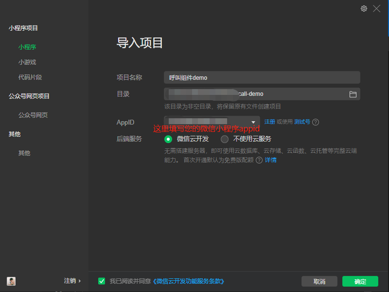
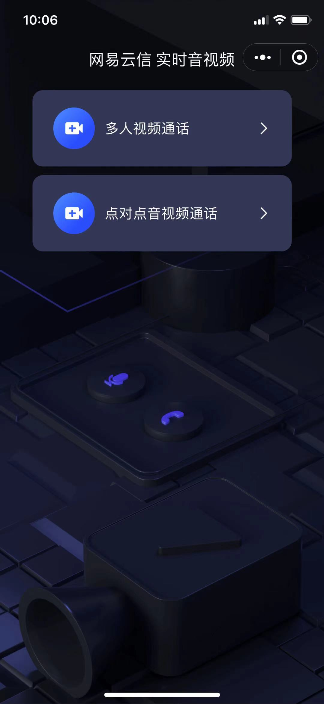

# 跑通小程序示例项目

网易智慧企业 在 GitHub 上提供一个开源的呼叫组件示例项目 [VideoCall]()。本文介绍如何快速跑通该示例项目，体验呼叫音视频通话功能。

##  前提条件
在开始运行示例项目之前，请确保您已完成以下操作：
联系云信商务获取开通以下权限，并联系技术支持配置产品服务和功能

  - 完成[应用创建和服务开通](../应用创建和服务开通.md)；
  - 获取新建应用的 AppKey；

## 开发环境

  * 微信 App iOS 最低版本要求：7.0.9。
  * 微信 App Android 最低版本要求：7.0.8。
  * 小程序基础库最低版本要求：2.10.0。
  * 已安装最新版本的微信开发者工具。
  * 已安装微信的移动端设备以供调试和运行体验。
  * 由于微信开发者工具不支持原生组件（即 `<live-pusher>` 和 `<live-player>` 标签），需要在真机上进行运行体验。
  * 由于小程序测试号不具备 `<live-pusher>` 和 `<live-player>` 的使用权限，需要申请常规小程序账号进行开发。
  * 不支持 uniapp 开发环境，请使用原生小程序开发环境。

## 操作步骤

  配置示例项目参考以下步骤：

  **组件待上传github**

  - 克隆[VideoCall](https://github.com/netease-kit/NEGroupCall/tree/master/Miniapp)仓库至本地项目。

  - 找到引入呼叫组件的js文件替换自己的 appkey

  - 打开微信开发者工具，选择【小程序】，单击新建图标，选择【导入项目】。填写您微信小程序的 AppID，单击【导入】。

  > !此处应输入您微信小程序的 AppID，而非 SDKAppID。

  

  - 单击【预览】，生成二维码，通过手机微信扫码二维码即可进入小程序。

  
