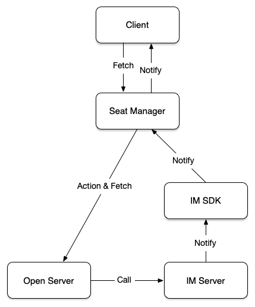

# 概述

## 产品介绍

多人连麦直播连麦和多人语聊房场景是泛娱乐产品中的主流场景，通过实时音视频通信技术打破了人们的社交上时间和空间的壁垒，并且直播间和语聊房间内的丰富玩法让社交娱乐更加无距离。但是技术上如果需要构建一个PK直播或者语聊场景，最核心的模块之一就是麦位管理，其中牵涉到复杂的业务逻辑和细节上的处理，例如用户上下麦的权限如何控制，麦序如何管理等，网易云信为了帮助客户更快速更高效的完成多人直播或者多人语聊的产品上线，提供了麦位管理业务功能的解决方案。将复杂的底层逻辑抽象成直观简单的业务功能API，快速高效稳定接入上线。

## 功能特性

| 功能        | 描述                                                         |
| :---------- | ------------------------------------------------------------ |
| 申请麦位    | 观众申请麦位，主播同意或拒接                     |
| 抱麦 | 主播将观众抱上麦，观众可以同意或拒绝 |
| 麦位管理 | 观众可以开关自己的摄像头或者麦克风，主播可以开关所有人的                       |

## 产品架构

麦位组件基于云信NIM SDK的基础能力，封装了业务侧的麦位相关请求，并解析服务端的相关消息协议，通过delegate 回调给业务层，完成麦位管理

## 体验应用
参考[互动直播](../../场景方案/PK直播/README.md)
