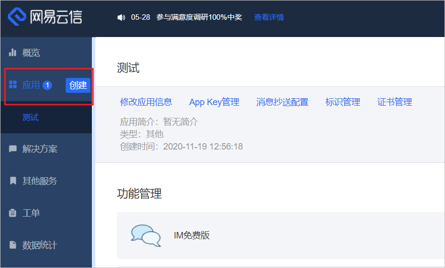
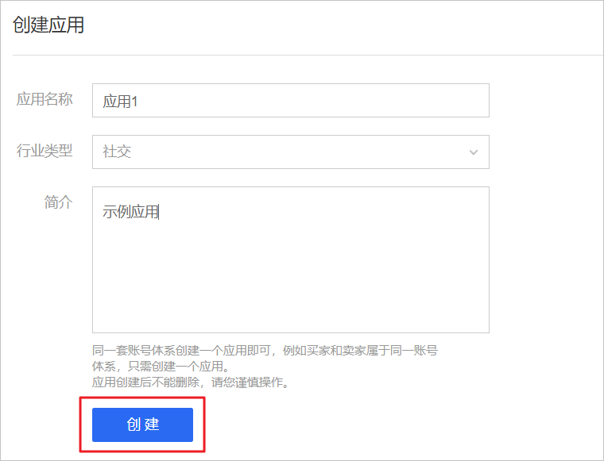
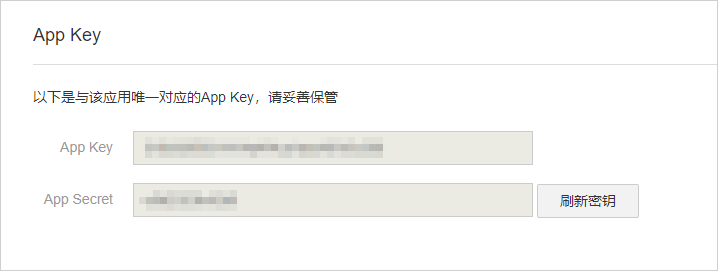
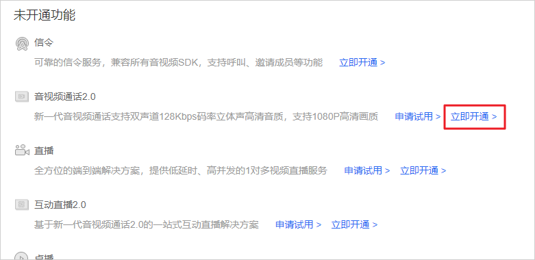
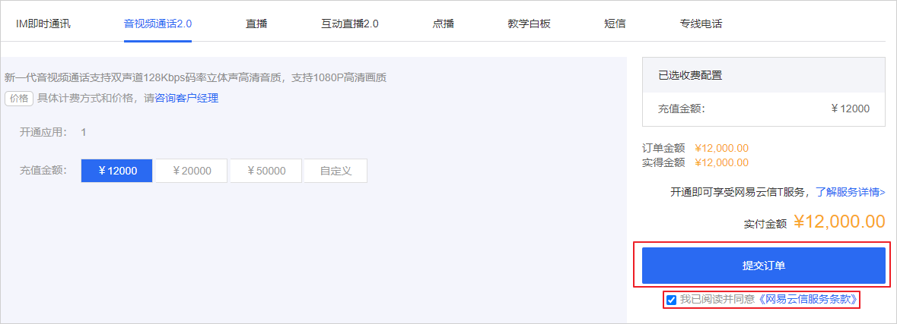

# 创建应用
创建应用是体验或使用网易云信各款产品和服务的首要前提，您可以参考本文档在网易云信控制台创建一个应用，并查看该应用的 App Key。

应用是网易云信各项服务的基础业务单元，每个应用有惟一的 App Key。同一套账号体系创建一个应用即可，例如买家和卖家属于同一账号体系，只需创建一个应用。

## 注意事项
 - 应用创建后不能删除，请根据您的实际需求创建应用。
 - 接入网易云信的过程中，调用服务端API和集成客户端SDK，都需要使用到应用对应的AppKey。请妥善保管。
 - 创建应用之后，如果在控制台单击刷新秘钥，刷新了 App Secret，开发者的代码中也要相应更换为新的 App Secret。

## 创建应用
 - 登录网易云信控制台。

 - 在左侧导航栏中找到应用，并单击创建。
	- 如果您是首次创建应用，请单击创建第一个应用。

	

 - 填写应用的基本信息。

    |配置	|说明 |
    |---|--- |
    |应用名称	|应用的名称，支持中文、英文、数字和特殊字符，长度为1~20个字符。|
    |行业类型	|该应用的对应行业。|
    |简介	|应用的备注说明或简单介绍，可选项，便于您标识该应用。|

    

 - 单击创建。
  创建应用后，您可以在左侧导航栏中查看该应用。

## 获取 App Key
 1. 在左侧导航栏中找到该应用，并单击应用名称。

 2. 单击 App Key 管理。

 3. 查看该应用的 App Key。

	

# 开通服务
若您之前从未开通过任何网易云信的产品服务，请先在官网首页通过 QQ、在线消息或电话等方式联系商务经理，一对一沟通您的具体需求。

 1. 登录网易云信控制台。

 2. 在左侧导航栏中单击指定应用名称，进入该应用的详情页面。

 3. 在未开通功能中找到音视频通话2.0。

 4. 在对应的位置单击立即开通。

	

 5. 设置充值金额。
具体的计费策略，请根据页面提示咨询商务经理。

 6. 在页面右侧勾选我已阅读并同意《网易云信服务条款》，并单击提交订单。
  
  
 
 7. 在支付台中确认金额、选择支付方式，并单击立即支付。

	

