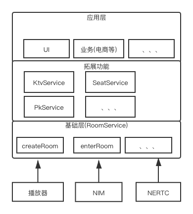

# 概述

## 产品介绍
网易云信推出的互动直播解决方案包括PK直播连麦和多人连麦解决方案，覆盖多个场景，例如秀场直播、户外直播、多人相亲等场景，依托23年通讯音视频技术积累，基于自研的全球实时传输网络WE-CAN提供高质量实时音视频体验。 PK连麦解决方案赋能传统的直播场景，在直播间里，为增进直播气氛、快速吸粉，房主可以邀请另一个直播间的房主进行连麦互动或在线 PK。连麦直播间内的观众可以同时观看两个房主互动，并根据房主表现实时赠送礼物，或快速切换直播间给不同的房主投票。 多人连麦解决方案可以应用于多人相亲，多人派对等多人连麦互动的场景，创建一个房间，主播可以邀请多名观众上麦进行互动聊天、或者进行线上游戏，真实还原线下多人轰趴的场景，通过实时而有趣的互动提升房间气氛进而提升主播人气。

## 功能特性

|  功能   | 描述  |
|  ----  | ----  |
| 单主播直播  | 一名主播直播，多名观众通过cdn拉流的方式观看 |
| 聊天互动  | 主播和观众通过云信聊天室能力实现互动 |
| 礼物打赏  | 观众给主播打赏虚拟礼物 |
| PK直播  | 两位主播PK，各自观众看到双方主播的表现 |
| 连麦直播  | 观众与主播连麦互动 |

## 产品架构 
1. 直播整体架构图   

* 直播业务整体依赖云信IM，RTC和播放器的能力   
* 基础层的RoomService提供直播的基础能力，并在这里封装RTC和IM   
* 扩展层为直播的拓展玩法，包括PK，麦位等相关能力
* 应用层为其他依附于直播的功能   

## 体验应用
### 下载
|  平台   | 下载  |
|  ----  | ----  |
| Android  | [下载地址]() |
| iOS  | 联系商务 |

### 效果展示
1. 主播开播  
  
2. 单主播直播  

3. Pk直播  

4. 连麦直播  

