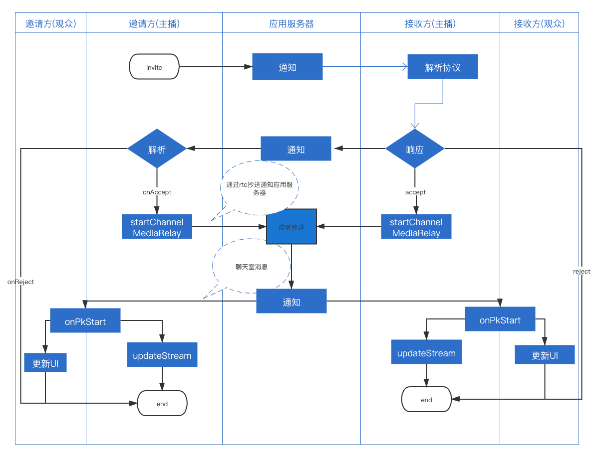

# 客户端方案(iOS)

## 功能实现流程
### 直播基础功能
1. 主播开播流程   

* 客户端请求应用服务器创建房间   
```
/// 主播-创建房间
/// @param params 创建房间所需参数
/// @param successBlock 成功回调
/// @param failedBlock 失败回调
- (void)createRoomWithParams:(NEPkCreateRoomParams *)params
               successBlock:(nullable NETSRequestCompletion)successBlock
                 failedBlock:(nullable NETSRequestError)failedBlock;
```
* 应用服务器通过请求IM服务器和rtc服务器分别创建IM聊天室和rtc 房间   
* 客户端判断返回值，如果失败退出，成功则分别加入rtc房间和聊天室，以上如果有任何一处失败都直接回调error，然后退出   
```
    [self.roomApiService createRoomWithParams:params successBlock:^(NSDictionary * _Nonnull response) {
        NECreateRoomResponseModel *result = response[@"/data"];
        [NETSChatroomService enterWithRoomId:result.live.chatRoomId userMode:NETSUserModeAnchor success:^(NIMChatroom * _Nullable chatroom, NIMChatroomMember * _Nullable me) {
            joinChannelAndPushStreamBlock(result);
        } failed:^(NSError * _Nullable error) {
            if (failedBlock) { failedBlock(error); }
        }];
                
    } failedBlock:^(NSError * _Nonnull error, NSDictionary * _Nullable response) {
        YXAlogError(@"create room failed,Error:%@",error);
        if (failedBlock) {
            failedBlock(error);
        }
    }];
```
* 加入RTC房间后，开启推流任务。
```
    int res = [NERtcEngine.sharedEngine joinChannelWithToken:token channelName:channelName myUid:uid completion:^(NSError * _Nullable error, uint64_t channelId, uint64_t elapesd,uint64_t uid) {
        if (error) {
            if (failedBlock) { failedBlock(error, nil); }
        } else {
            NERtcLiveStreamTaskInfo *task = [NETSPushStreamService streamTaskWithUrl:streamUrl uids:@[@(uid)]];
            [NETSPushStreamService addStreamTask:task successBlock:^{
                if (successBlcok) { successBlcok(task); }
            } failedBlock:failedBlock];
        }
    }];

```
2. 观众加入直播房间   
* 观众通过调用应用服务器提供的/live/v1/join接口获取房间信息
```
/// 观众-进入房间（Pk连麦需要）
/// @param params 创建房间所需参数
/// @param successBlock 成功回调
/// @param failedBlock 失败回调
- (void)enterRoomWithParams:(NEPkEnterRoomParams *)params
               successBlock:(nullable NETSRequestCompletion)successBlock
                 failedBlock:(nullable NETSRequestError)failedBlock;
```
* 加入聊天室
```
- (void)_joinChatRoom:(NSString *)roomId successBlock:(void(^)(void))successBlock failedBlock:(void(^)(NSError *))failedBlock
{
    if (isEmptyString(roomId)) {
        if (failedBlock) {
            NSError *error = [NSError errorWithDomain:@"NETSAudience" code:NETSRequestErrorMapping userInfo:@{NSLocalizedDescriptionKey: @"观众端聊天室ID为空"}];
            failedBlock(error);
        }
        return;
    }
    
   // 检查主播是否在线
    void(^checkAuthodOnline)(NSString *) = ^(NSString *roomId) {
        [NETSChatroomService isOnlineWithRoomId:roomId completion:^(BOOL isOnline) {
            if (isOnline) {
                if (successBlock) { successBlock(); }
            } else {
                if (failedBlock) {
                    NSError *error = [NSError errorWithDomain:@"NETSAudience" code:NETSRequestErrorMapping userInfo:@{NSLocalizedDescriptionKey: @"主播已下线"}];
                    failedBlock(error);
                }
            }
        }];
    };
    
    // 加入聊天室
    [NETSChatroomService enterWithRoomId:roomId userMode:NETSUserModeAudience success:^(NIMChatroom * _Nullable chatroom, NIMChatroomMember * _Nullable me) {
        checkAuthodOnline(roomId);
    } failed:^(NSError * _Nullable error) {
        if (failedBlock) { failedBlock(error); }
    }];
}
```
* 布局播放器
```
- (void)_layoutPlayerWithY:(CGFloat)y
{
    [self.contentView addSubview:self.player.view];
    [self.contentView sendSubviewToBack:self.player.view];
    
    self.player.view.top = y;
    
    if (y == 0) {
        self.player.view.frame = [self _fillPlayerRect];
    }
}
```
*设置拉流地址
```
/// 播放指定url源
- (void)_playWithUrl:(NSString *)urlStr
{
    NSURL *url = [NSURL URLWithString:urlStr];
    [self.player setPlayUrl:url];
    [self.player prepareToPlay];
}
```
3. 观众打赏流程   

* 观众调用应用服务器提供的打赏接口打赏
```
/// 直播间打赏
/// @param params 请求参数
/// @param successBlock 成功回调
/// @param failedBlock 失败回调
- (void)requestRewardLiveRoomWithParams:(NEPkRewardParams *)params
                   successBlock:(nullable NETSRequestCompletion)successBlock
                    failedBlock:(nullable NETSRequestError)failedBlock;
```
* 应用服务器通过聊天室消息将打赏信息同步给房间里的所有人
```
-(void)onRecvMessages:(NSArray<NIMMessage *> *)messages {
    for (NIMMessage *message in messages) {
        if (![message.session.sessionId isEqualToString:self.chatroomId]
            && message.session.sessionType == NIMSessionTypeChatroom) {
            //不属于这个聊天室的消息
            return;
        }
        switch (message.messageType) {
            case NIMMessageTypeText://文本类型消息
                
                break;
            case NIMMessageTypeCustom: {
                
                NIMCustomObject *object = message.messageObject;
                
                if ([object.attachment isKindOfClass:[NEPkLiveStartAttachment class]]) {
                    if (self.delegate && [self.delegate respondsToSelector:@selector(receivePkStartAttachment:)]) {
                        NEPkLiveStartAttachment *data = (NEPkLiveStartAttachment *)object.attachment;
                        [self.delegate receivePkStartAttachment:data];
                    }
                }else if ([object.attachment isKindOfClass:[NEStartPunishAttachment class]]) {
                    if (self.delegate && [self.delegate respondsToSelector:@selector(receivePunishStartAttachment:)]) {
                        NEStartPunishAttachment *data = (NEStartPunishAttachment *)object.attachment;
                        [self.delegate receivePunishStartAttachment:data];
                    }
                }else if ([object.attachment isKindOfClass:[NEPkEndAttachment class]]) {
                    if (self.delegate && [self.delegate respondsToSelector:@selector(receivePkEndAttachment:)]) {
                        NEPkEndAttachment *data = (NEPkEndAttachment *)object.attachment;
                        [self.delegate receivePkEndAttachment:data];
                    }
                }else if ([object.attachment isKindOfClass:[NEPkRewardAttachment class]]){
                    if (self.delegate && [self.delegate respondsToSelector:@selector(receivePkRewardAttachment:)]) {
                        NEPkRewardAttachment *data = (NEPkRewardAttachment *)object.attachment;
                        [self.delegate receivePkRewardAttachment:data];
                    }
                }else if ([object.attachment isKindOfClass:[NELiveTextAttachment class]]){
                    if (_delegate && [_delegate respondsToSelector:@selector(onRecvRoomTextMsg:)]) {
                        [_delegate onRecvRoomTextMsg:@[message]];
                    }
                }
            }
                 
                break;
            case NIMMessageTypeNotification:{
                [self dealWithNotificationMessage:message];
            }
                break;
            default:
                break;
        }
    }
}
```
### PK直播
1. 开始PK   

* 主播A通过调用应用服务器接口发起Pk请求
```
      [[NEPkService sharedPkService] requestPkWithOperation:NEPkOperationInvite targetAccountId:room.anchor.accountId successBlock:^(NSDictionary * _Nonnull response) {
        successBlock(room.anchor.nickname);
    } failedBlock:^(NSError * _Nonnull error, NSDictionary * _Nullable response) {
        if (error) {
            YXAlogError(@"requestPk failed,error = %@",error);
            failedBlock(error);
        }
        [NETSToast hideLoading];
    }];
```
* 主播B通过解析应用服务器发送的透传消息接收PK请求并响应   
* 同意后双发开始跨频道转发
```
- (void)startRtcChannelRelayWithChannelName:(NSString *)channelName token:(NSString *)checkSum rooomUid:(int64_t)uid {
    ///实例化config
    NERtcChannelMediaRelayConfiguration *config = [[NERtcChannelMediaRelayConfiguration alloc]init];
    //添加目标房间1信息
    NERtcChannelMediaRelayInfo *info = [[NERtcChannelMediaRelayInfo alloc]init];
    info.channelName = channelName;
    info.token = checkSum;
    info.uid = uid;
    [config setDestinationInfo:info forChannelName:info.channelName];

    //开始转发
    int ret = [[NERtcEngine sharedEngine] startChannelMediaRelay:config];
    if(ret == 0) {
        YXAlogError(@"startRtcChannelRelay success");
    }else {
        //失败处理
        YXAlogError(@"startRtcChannelRelay failed,error = %d",ret);
    }
}
```
* 应用服务器通过抄送接收双发跨频道转发的消息判断PK开始
* 应用服务器通过发送聊天室消息告诉双发PK开始
* 双发主播更新推流信息
```
//更新推流任务
- (void)_updateLiveStreamTask:(NSArray *)uids {
    
    NERtcLiveStreamTaskInfo* taskInfo = [NETSPushStreamService streamTaskWithUrl:self.createRoomModel.live.liveConfig.pushUrl uids:uids];
    
    [NETSPushStreamService updateLiveStreamTask:taskInfo successBlock:^{
        YXAlogInfo(@"updateLiveStreamTask success");
    } failedBlock:^(NSError * _Nonnull error) {
        YXAlogError(@"updateLiveStream failed,error = %@",error);
    }];
}


//更新推流任务
+ (void)updateLiveStreamTask:(NERtcLiveStreamTaskInfo *)taskInfo
               successBlock:(void(^)(void))successBlock
                failedBlock:(void(^)(NSError *))failedBlock {
    int ret = [NERtcEngine.sharedEngine updateLiveStreamTask:taskInfo
                                               compeltion:^(NSString * _Nonnull taskId, kNERtcLiveStreamError errorCode) {
    if (errorCode == 0) {
        
        successBlock();
          //推流任务添加成功
        }else {
          //推流任务添加失败
            NSError *error = [NSError errorWithDomain:@"NETSRtcErrorDomain" code:errorCode userInfo:@{NSLocalizedDescriptionKey: @"updateLiveStream failed"}];
            failedBlock(error);
        }
    }];
    if (ret != 0) {
      //更新失败
        NSError *error = [NSError errorWithDomain:@"NETSRtcErrorDomain" code:ret userInfo:@{NSLocalizedDescriptionKey: @"updateLiveStream failed"}];
        failedBlock(error);
    }
}
```
2. 结束PK

* pk倒计时结束，有主播主动结束PK或应用服务器收到某个主播rtc断开抄送都会触发Pk结束流程
* 应用服务器通过聊天室发送结束Pk的消息，主播端收到后结束跨频道转发，并更新推流任务   
### 连麦直播   
接入麦位组件实现，参考[麦位组件](../../../业务组件/麦位组件/README.md)
