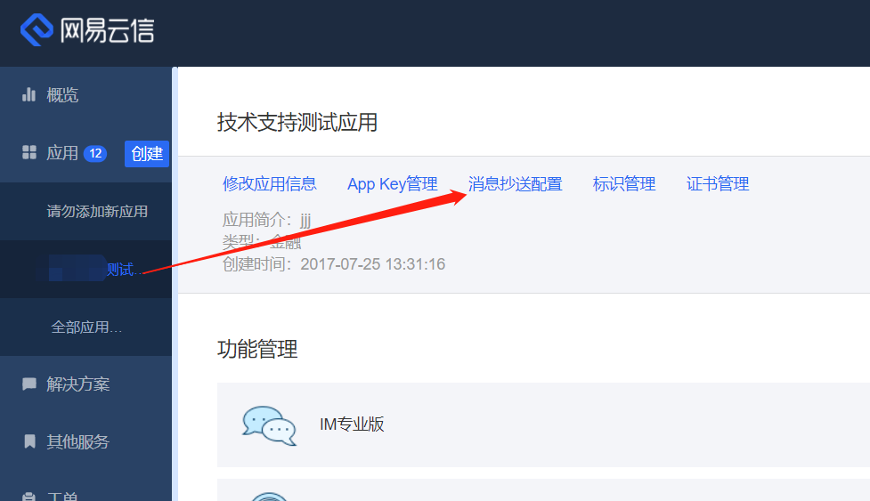
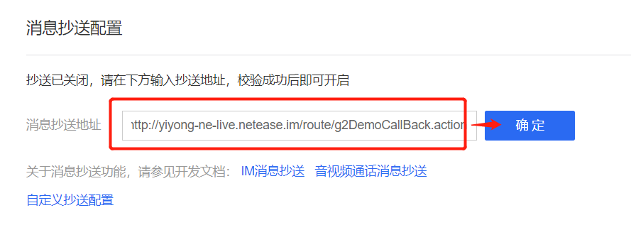

# 云信控制台配置
## 后台配置项

- 多端登录配置需要设置为各端均可以同时登录在线（不互踢）

- 聊天室需要开启进出通知的下发，并设置多端登录配置为只允许一端登录（聊天室互踢）

## 抄送相关配置：

- 配置抄送地址： http://yiyong-ne-live.netease.im/route/g2DemoCallBack.action

- 抄送地址配置完毕后，需要勾选相应的抄送类型，如下：

