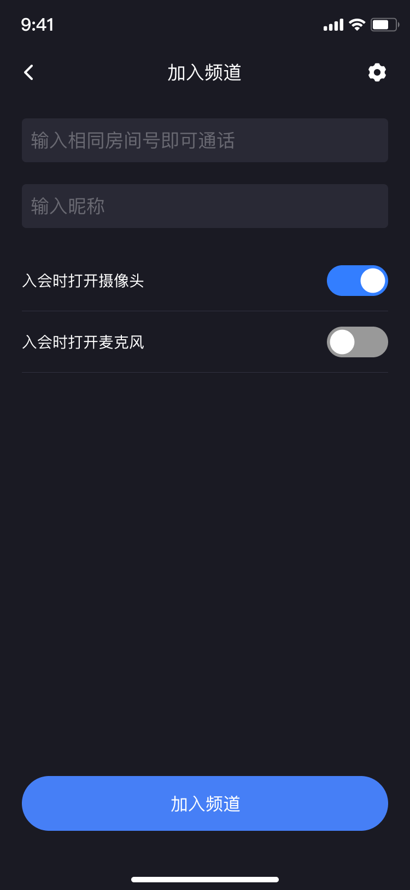
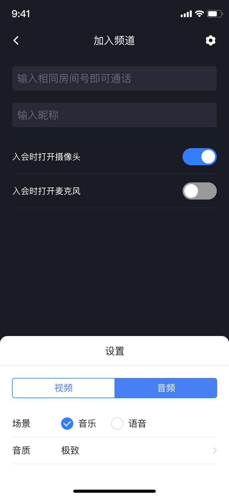
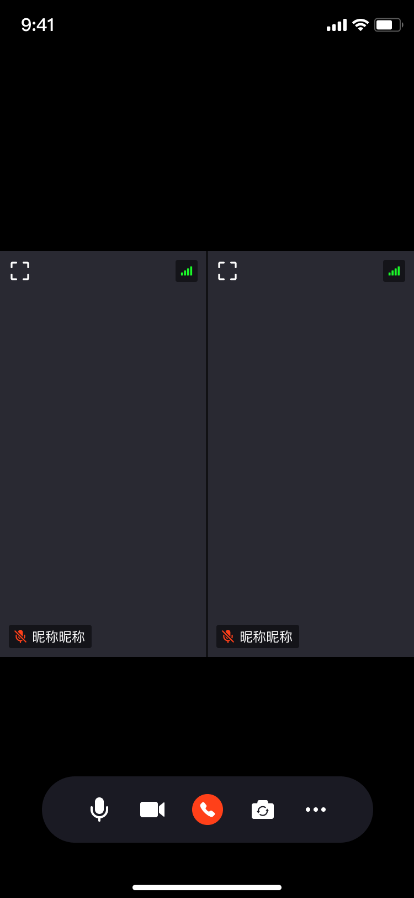
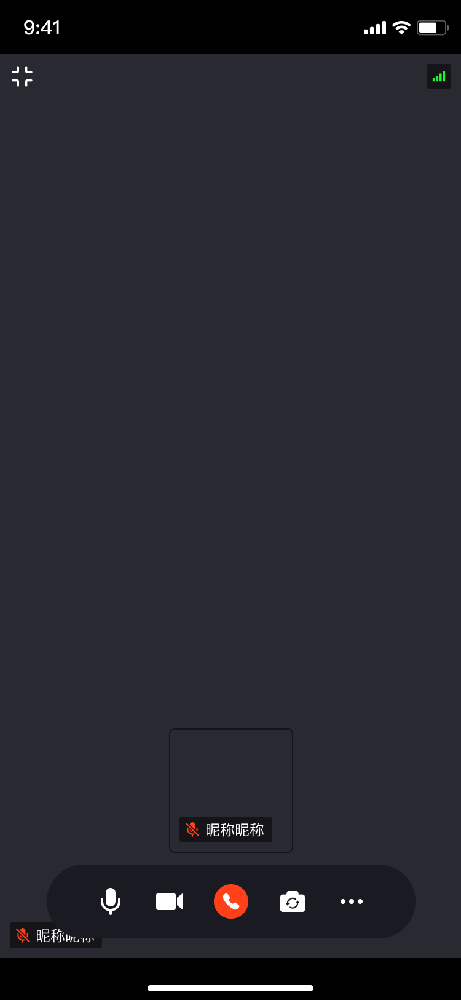
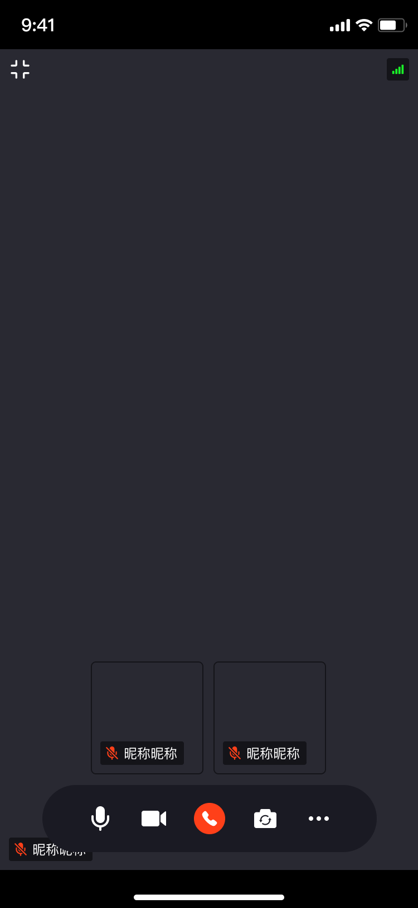

# 概述

## 产品介绍
基础多人音视频通话，通过输入房间号即可快速体验高清音视频通话功能。支持自定义视频分辨率、帧率、音质、美颜、切换布局等功能

## 功能特性

|  功能   | 描述  |
|  ----  | ----  |
| 多人音视频通话  | 最多4人同时进行音视频通话，支持开关摄像头、麦克风 |
| 演讲模式  | 支持房间内单个用户画面最大化 |
| 美颜功能  | 支持美白、磨皮等基础美颜功能 |

## 体验应用
### 下载
|  平台   | 下载  |
|  ----  | ----  |
| Android  | [下载地址](https://www.pgyer.com/LpmN) |
| iOS  | [下载地址]() |

### 效果展示
 
- 加入频道  

    

- 视频参数设置  

    

- 音频参数设置

    

- 通话-单人  

      

- 通话-双人  
  
    

- 通话-三人  
  
    

- 通话-四人  
    
    

- 演讲者模式-双人  
  
      

- 演讲者模式-三人  
  
    

- 演讲者模式-四人  
  
      

- 通话实时数据  
  
    

