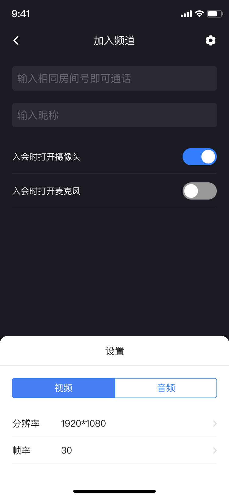
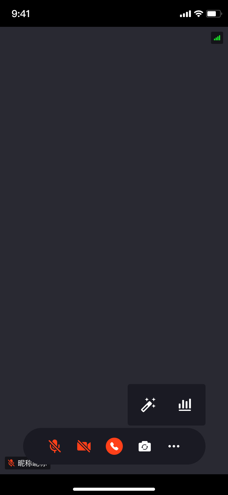
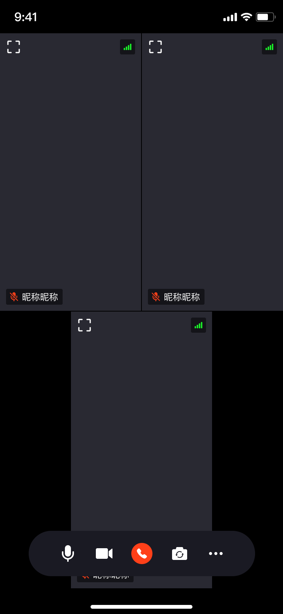
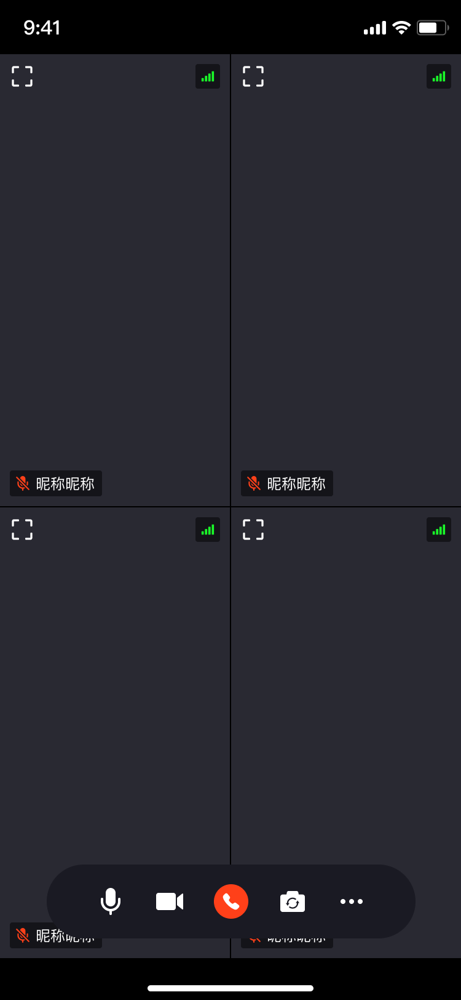
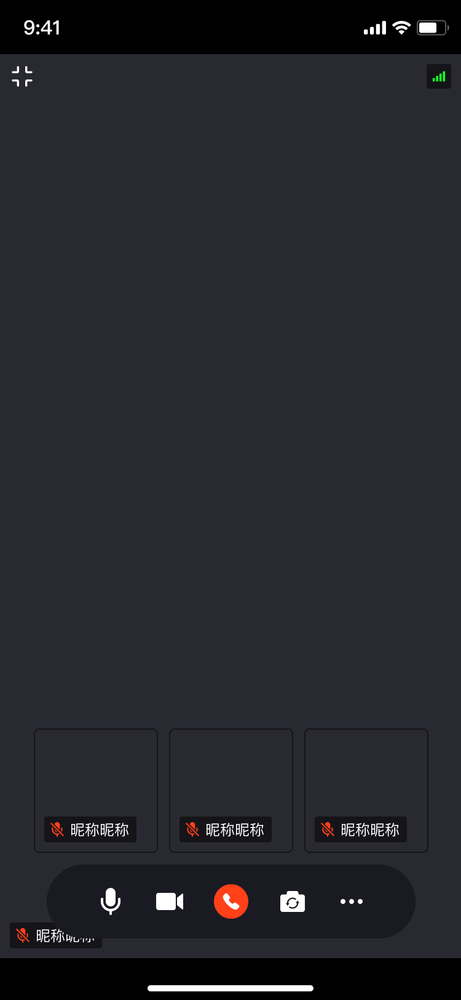
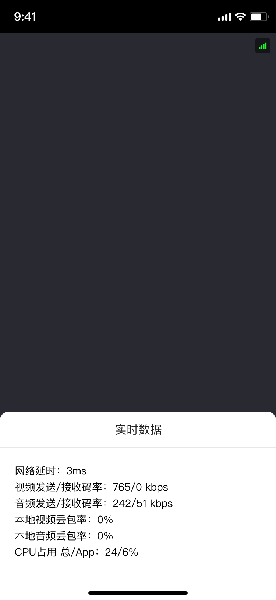

# 概述

## 产品介绍
基础多人音视频通话，通过输入房间号即可快速体验高清音视频通话。支持自定义视频分辨率、帧率、音质、美颜、切换布局等功能

## 功能特性

|  功能   | 描述  |
|  ----  | ----  |
| 多人音视频通话  | 最多4人同时进行音视频通话，支持开关摄像头、麦克风 |
| 演讲模式  | 支持专注在某个人的视角 |
| 美颜功能  | 支持美白、磨皮等基础美颜功能 |

## 体验应用
### 下载
|  平台   | 下载  |
|  ----  | ----  |
| Android  | [下载地址](https://www.pgyer.com/LpmN) |
| iOS  | [下载地址]() |

### 效果展示
 
1. 加入频道  

2. 视频参数设置  

3. 音频参数设置  

4. 通话-单人  
  
5. 通话-双人  

6. 通话-三人  

7. 通话-四人  

8. 演讲者模式-双人  
  
9. 演讲者模式-三人  

10. 演讲者模式-四人  
  
11. 通话实时数据  

