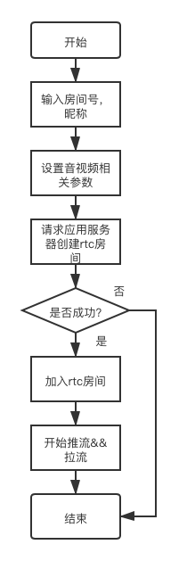
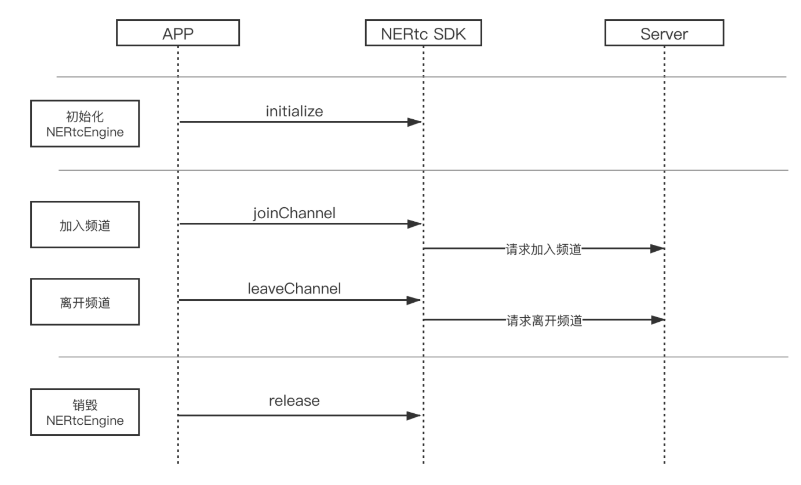

# 客户端实现方案
## 功能实现流程
### 多人通话基础流程图

### 音视频通话流程图

### 多人通话项目结构
|  目录   | 说明  |
|  ----  | ----  |
| NEGroupCall-iOS  | 应用主入口包含外部页面框架。 |
| NEGroupCall-iOS-Class | 项目主要功能逻辑，包含用户登录、注册、多人通话等 |
| NEGroupCall-iOS-Macro  | 宏定义|
| NEGroupCall-iOS-Class-Service  | 网络请求相关 |
| NEGroupCall-iOS-Base  | 基础类 |
| NEGroupCall-iOS-Support  | 分类和工具集 |
| NEGroupCall-iOS-Class-beauty  | 美颜lib，基于相芯 |

### 核心类说明
|  类   | 说明  |
|  ----  | ----  |
| NEMultiCallSetupViewController  | 加入频道页，可在该页面设置一些音视频相关的参数 |
| NEGroupVideoVC  | 多人通话页，可打开关闭摄像头、麦克风 |
| NEStatsInfoVC  | 通话过程中音视频实时数据展示 |

