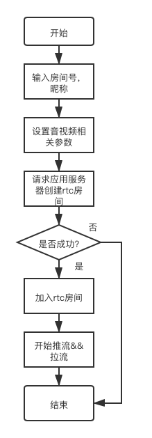
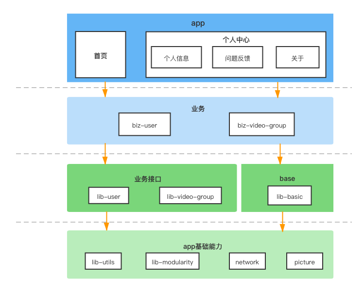

# 客户端实现方案
## 功能实现流程
### 多人通话基础流程图

### 多人通话工程架构图

### 多人通话项目结构
|  目录   | 说明  |
|  ----  | ----  |
| app  | 应用主入口包含外部页面框架。 |
| biz-user | 用户相关业务，包括登录、注册、用户信息功能 |
| lib-user  | 用户lib |
| lib-modularity  | app模块化 |
| lib-basic  | 基础lib |
| lib-utils  | 工具集 |
| lib-beauty-faceunity  | 美颜lib，基于相芯 |
| biz-video-group  | 多人音视频通话业务 |
| lib-video-group  | 多人音视频通话lib |

### 核心API参考
[核心API参考](../开发文档/API接口/API接口_Android.md)