# 概述

## 产品介绍

智慧云课堂（PaaS 方案）是网易云信提供的在线互动课堂场景解决方案，该方案中集成了网易云信IM SDK、音视频通话 2.0 SDK 和互动白板 SDK的产品能力，基于在线教育场景提供多种课堂模式实践。

智慧云课堂专为线上课堂场景打造，覆盖多种班型的教学场景、全终端的接入能力，支持课程录制、白板互动、课程活跃度分析等远程课堂功能。在实现云课堂实时互动功能的基础上，还支持业务功能的灵活扩展，帮助您快速上线专属互动教学平台。

智慧云课堂提供 1 对 1 互动教学、1 对 N 互动小班课、互动直播大班课课堂模式，可满足在线教育行业通用需求，适用于K12 教育、线下辅导、音乐陪练、留学语言培训等多种教育场景。

## 课堂模式

智慧云课堂（PaaS方案）支持以下课堂模式，您也可以根据实际场景需求进行设计。

- 1 对 1 互动教学

  1 对 1 互动教学是指1 位老师对 1 位学生进行在线专属辅导教学。1 对 1 互动教学过程中，老师和学生通过 RTC 进行实时音视频互动。

- 1 对 N 互动小班课

  1 对 N 互动小班课是指 1 位老师对多位学生进行在线辅导教学，学生人数在 2~6 人之间， 通常为 1 对 2、 1 对 4、1 对 6 等场景。老师在线授课，学生可实时发言提问，学生之间也可进行实时互动。

- 互动直播大班课

  互动直播大班课是指 1 位老师在课堂上进行教学，成千上万学生在线观看的教学模式。学生可以举手申请上台发言，与老师进行实时音视频互动。

## 产品架构

智慧云课堂场景方案由网易云信专为在线教育场景打造，具备高可扩展性、全平台覆盖等优势。

| 类别         | 方案说明                                                     |
| ------------ | ------------------------------------------------------------ |
| 适用客户     | 适用于有一定的研发人力资源、开发周期较长、定制化需求多的客户。 |
| 开发成本     | 高                                                           |
| 上线时间     | 1 ~ 3个月                                                    |
| 实现功能     | 客户可基于即时通信、RTC 等能力型 SDK 自行实现实时音视频、实时消息、白板等功能。 |
| 可扩展性     | 高                                                           |
| 业务数据安全 | 云信不保存客户业务数据，开发者自行管理业务数据的存储。       |
| 前端 UI      | 客户可以自行实现 UI 及交互。                                 |
| 平台         | Android、iOS、Web、Windows、macOS、H5、小程序等多平台架构支持。 |
| 覆盖场景     | 1 对 1 教学、多人小班课、互动大班课。客户自行定义和实现任意在线教学场景。 |

## 功能介绍

- 音视频通话

  教师和学生可以发送和接收音视频流

- 屏幕共享

  教师和学生可以在课堂上分享他们的屏幕、窗口或浏览器界面。

- 互动白板

  互动白板可应用于线上素质教育培训、职业教育、K12 学科辅导等课堂场景，教师可借助涂鸦、文本、直线、激光笔等教具，边演示课件边勾画要点。开发者借助互动白板的互动涂鸦、实时同步、课件文档共享、录制回放等功能，可以满足在线教育低延时高互动场景需求。

- 聊天互动

  教师和学生可以在课堂中发送文字和图片消息进行互动

- 举手上台

  在互动直播大班课中，默认情况下，学生无法发送音频和视频，也无法操作白板。学生可以“举手”要求发言，教师同意后可以发送流并与教师互动。

- 教师对学生权限控制

  教师可以对学生进行权限控制，包括授予/收回白板编辑权限、授予/收回屏幕共享权限、开关音视频、全体声音禁言、全体聊天禁言

- 自定义课堂UI

  智慧云课堂提供了UIKit。开发者可以基于UIKit进行定制化修改，也可以自行实现UI。

- 录制回放

  上课过程中，服务端会自动开启录制服务，对音视频内容、白板内容、屏幕共享内容进行同步录制，课堂结束后学生可以观看录制内容进行课后复习。

## 平台支持

| 课堂角色 | Android | iOS  | Web  | macOS | Windows |
| :------- | :------ | :--- | :--- | :---- | :------ |
| 老师端   | ✔       | ✔    | ✔    | ✔     | ✔       |
| 学生端   | ✔       | ✔    | ✔    | ✔     | ✔       |

> 说明：
> - 智慧云课堂macOS 和 Windows 客户端基于 Electron 框架开发。

## 体验应用

网易云信智慧云课堂（PaaS方案）的 [示例代码及演示APP](https://netease.im/edu#page4)，您可以在 Android 、iOS 和 Web 平台中下载安装或直接打开对应 App，快速体验网易云信智慧云课堂方案的产品能力。

您也可以参考 示例代码 源码，在您的本地项目中快速实现 1 对 1 互动教学、1 对 N 互动小班课、互动直播大班课等教育场景。

> 说明：
> - 智慧云课堂（PaaS方案）的示例源码仅供开发者接入参考，实际应用开发场景中，请结合具体业务需求修改使用。
> - 若您计划将源码用于生产环境，请确保应用正式上线前已经过全面测试，以免因兼容性等问题造成损失。

### 效果展示
智慧云课堂 示例代码 的界面效果图如下所示：

- 进入课堂
<image width="70%" src="Images/enterroom.png">

- 课堂开始
<image width="70%" src="Images/classstart.png">

- 课堂聊天室
<image width="70%" src="Images/chatroom.png">

- 课堂成员管理页面：
<image width="38%" src="Images/members.png">

- 录制回放
<image width="27%" src="Images/screenshot.png">

