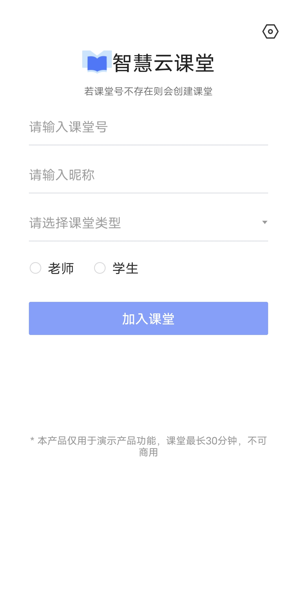
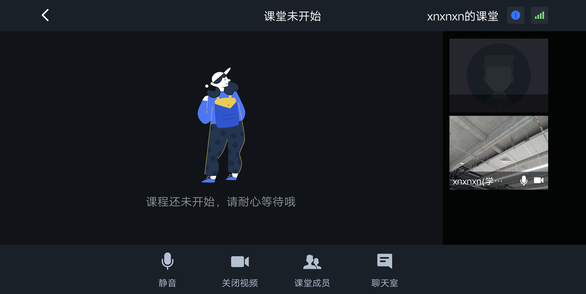

# 跑通示例项目

智慧云课堂（PaaS 方案）是网易云信提供的在线互动课堂场景解决方案。基于在线教育的常见场景，网易云信提供智慧云课堂开源项目，为您演示 1 对 1、小班课和大班课的典型方案。您可以直接基于我们的 Demo 修改适配，也可以参考 Demo，自行集成云信 IM SDK、音视频通话 2.0 NERTC SDK 和互动白板 SDK，实现在线教育场景。


本文展示如何编译并运行 Android 平台的智慧云课堂示例项目，体验各个场景的在线课堂。

## 前提条件
在开始运行示例项目之前，请确保您已完成以下操作：

- 在云信控制台创建应用，并获取对应的 AppKey。
- 为此应用开通以下相关服务与抄送：
  - 产品服务：音视频通话 2.0、IM 专业版、聊天室、信令、互动白板、云端录制、点播。
  - 产品功能：
    - 音视频通话 2.0 的云端录制和抄送功能。
    - 互动白板的文档转码和云端录制功能。
  - 音视频通话 2.0 抄送：1-房间启动、2-房间结束、3-房间录制文件下载信息抄送 、4-用户进入房间、5-用户离开房间、8-房间时长抄送。

## 注意事项
- 开通相关产品功能与抄送，请联系[联系云信商务经理](https://yunxin.163.com/bizQQWPA.html)。
- 如果仅需要本地跑通示例项目，简单体验智慧云课堂，您可以使用智慧云课堂``体验账号``。体验账号已开通相关权限与抄送，课堂时长限制为 30 分钟。
- 体验账号仅供开发者体验与测试，请勿在线上环境中使用。

## 开发环境
在开始运行示例项目之前，请确保开发环境满足以下要求：

| 环境要求         | 说明                                                         |
| ---------------- | ------------------------------------------------------------ |
| JDK 版本         | 1.8.0 及以上版本                                             |
| Android API 版本 | API 23、Android 6.0 及以上版本                               |
| CPU架构          | ARM64、ARMV7                                                 |
| IDE              | Android Studio                                               |
| 其他             | 依赖 Androidx，不支持 support 库。Android 系统 4.3 或以上版本的移动设备。 |

## 运行示例项目
1. 获取示例项目。
在智慧云课堂[Demo体验](https://netease.im/edu#page4)页面下载需要体验的示例项目或 Demo 源码工程。

2. 开启 Android 设备的开发者选项，通过 USB 连接线将 Android 设备接入电脑。
3. 通过 Android Studio 打开项目。
4. 在示例项目中配置相关字段。
如果需要基于 Demo 开发自己的应用，在 config.properties 中将以下字段改为您的真实信息。

| 配置项        | 说明                                        |
| ------------- | ------------------------------------------- |
| APP_KEY       | 应用的 AppKey。可以在网易云信控制台中查看。 |
| AUTHORIZATION | 调用服务端接口时，请求头中的校验参数。      |

> 说明：
> 如果仅需要本地跑通示例项目，您可以使用[网易云信体验账号](https://github.com/netease-kit/WisdomEducation/tree/main/Wisdom_Education_Docs)。体验账号的课堂时长限制为 30 分钟。
5. 在 Android Studio 中，**单击Sync Project with Gradle Files** 按钮，同步工程依赖。
6. 选中设备直接运行，即可体验 Demo。

7. 输入课程号、昵称，选择课堂类型、老师或学生，然后点击加入课堂，即可进入智慧云课堂，看到以下画面


## 示例项目结构
```
├── app                      壳工程
├── base                     公共基础组件
├── edu-logic                教育核心业务模块
│   ├── cmd                 IM透传通知
│   ├── model               数据定义
│   ├── net.service         API接口请求      
│   ├── option              基础配置定义
│   └── service             业务服务
├── edu-ui                   UIKit组件
│   ├── clazz               各种房间Activity
├── im                       IM服务组件
├── rtc                      音视频通话服务组件
├── whiteboard               白板组件
└── config.properties        定义项目需要的各种配置信息
```


## 自定义课堂UI

如果 Demo 中默认实现的 UI 不符合您的预期，您可以按需实现自己的用户界面，即只使用我们封装好的组件所提供的音视频能力，自行实现 UI 部分。

教育组件功能模块：


**EduUI：**包含教育组件的UI的实现，包括1v1、小班课、大班课、直播大班课场景的ViewController、View以及model部分。

**EduLogic：**是依赖云信的音视频SDK、IMSDK以及白板SDK对于教育逻辑的实现，分别对应NEEduRtcService、NEEduIMService、NEEduBoardService。


## 后续步骤

现在你已经初步体验了智慧云课堂的功能，接下来可试着将[智慧云课堂集成到你自己的 app 项目中](开发文档/README.md)。
