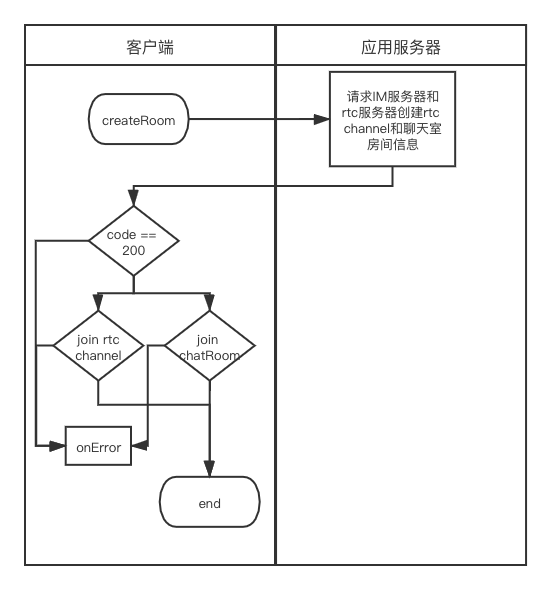
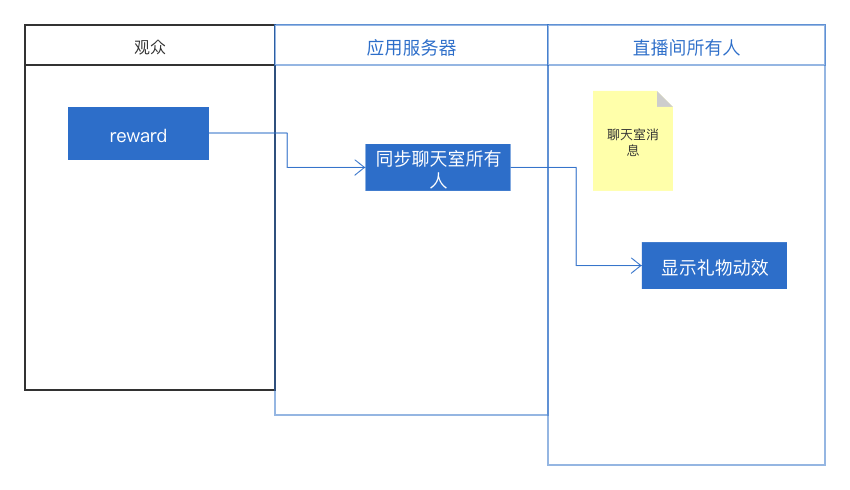
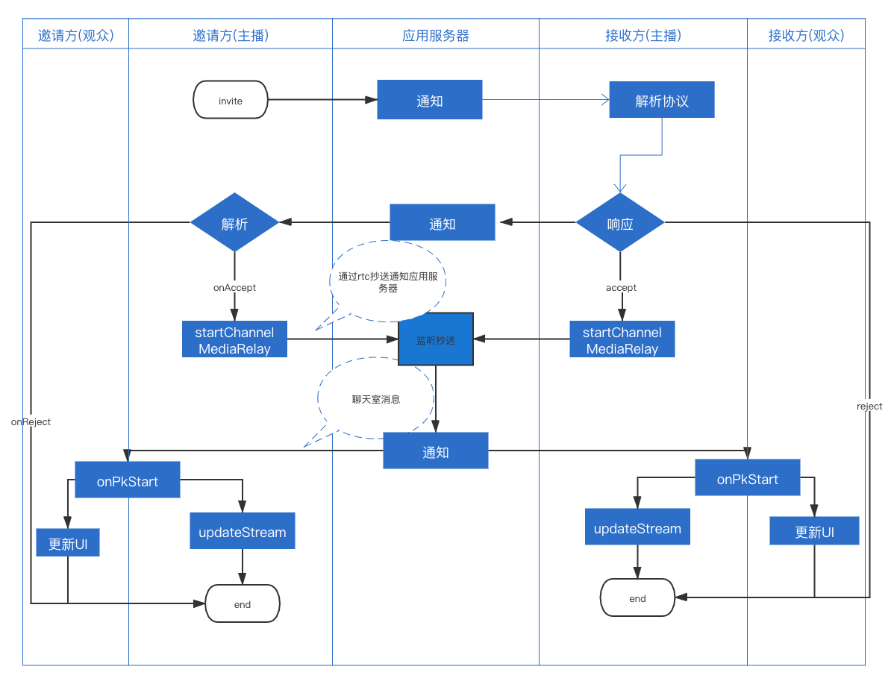
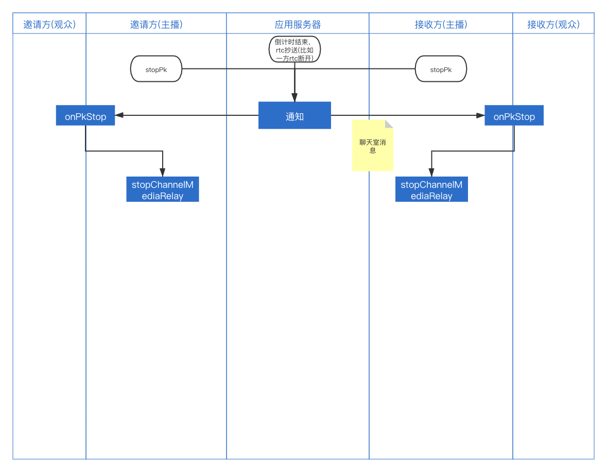

# 客户端方案

## 功能实现流程
### 直播基础功能
1. 主播开播流程

* 客户端请求应用服务器创建房间   
* 应用服务器通过请求IM服务器和rtc服务器分别创建IM聊天室和rtc 房间   
* 客户端判断返回值，如果失败退出，成功则分别加入rtc房间和聊天室，以上如果有任何一处失败都直接回调onError，然后退出   
* 创建房间成功后开始添加推流任务
2. 观众加入直播房间
* 观众通过调用应用服务器提供的joinRoom接口获取房间信息
* 加入聊天室
* 通过播放器拉流
3. 观众打赏流程

* 观众调用应用服务器提供的打赏接口打赏
* 应用服务器通过聊天室消息将打赏信息同步给房间里的所有人
### PK直播
1. 开始PK   

* 主播A通过调用应用服务器接口发起Pk请求
* 主播B通过解析应用服务器发送的透传消息接收PK请求并响应   
* 同意后双发开始跨频道转发
* 应用服务器通过抄送接收双发跨频道转发的消息判断PK开始
* 应用服务器通过发送聊天室消息告诉双发PK开始
* 双发主播更新推流信息
2. 结束PK

* pk倒计时结束，有主播主动结束PK或应用服务器收到某个主播rtc断开抄送都会触发Pk结束流程
* 应用服务器通过聊天室发送结束Pk的消息，主播端收到后结束跨频道转发，并更新推流任务   
### 连麦直播   
接入麦位组件实现，参考[麦位组件](../../../基础组件/麦位组件/README.md)
